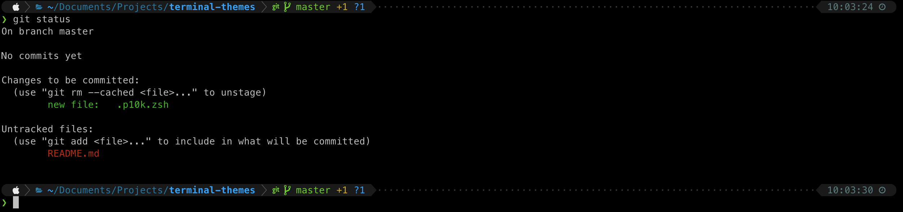

# Terminal themes

This repository uses the [powerlevel10k](https://github.com/romkatv/powerlevel10k#are-there-configuration-options-that-make-powerlevel10k-slow) theme.

<div align="center">
  
</div>
<br>

# Installation

1. Install [Oh my zsh](https://github.com/ohmyzsh/ohmyzsh)

2. Clone the powerlevel10k project using  the following command:
    ```shell
    $ git clone --depth=1 https://github.com/romkatv/powerlevel10k.git ${ZSH_CUSTOM:-$HOME/.oh-my-zsh/custom}/themes/powerlevel10k
    ```

3. Update the `ZSH_THEME` variable in `$HOME/.zshrc`
    ```shell
    ZSH_THEME="powerlevel10k/powerlevel10k"
    ```

4. Restart Zsh with `exec zsh`

5. Clone this repository:
    ```shell
    $ git clone https://github.com/edualb/terminal-themes.git
    ```

6. Switch the `$HOME/.p10k.zsh` by `.p10k.zsh` that you can find in this repository  


